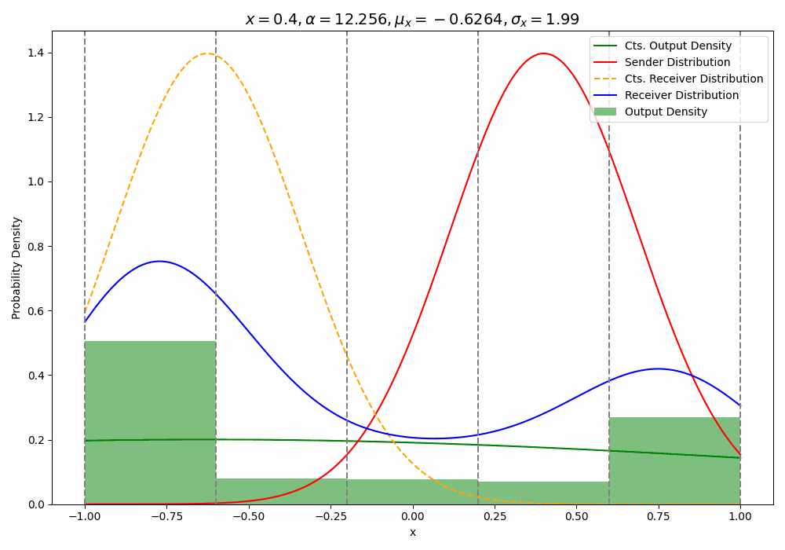

# Bayesian Flow Networks

This repo is a simple replication of the discrete and discretised implementations of Bayesian flow networks (BFNs).

## CIFAR 10 Sampling

Data Expectation Distribution (Output distribution)

Updated Prior (Input distribution)

## Discretised Examples

### Distributions over time

### Updated Prior & Data Expectation Trajectories and Probability Flow

### Sampling with different steps

### Un-conditional inpainting (using something similar to repaint r=20)

### Toy examples (discretised) with 5 bins

# How does BFN work?

We create a 'flow' that uses bayesian updates to transform from a prior to a data sample

During training we learn the flow, from our prior using noisy samples from our data 

At sampling time we simply swap out our sender distribution with our receiver distribution

### This Repo

- Replicates BFN with simple toy examples for discrete and discretised datasets.
- Train a discretised model on the CIFAR-10 dataset (see results above).
- Provides some math breakdown in the_math.md

The original paper can be found here: https://arxiv.org/pdf/2308.07037.pdf

The official code implementation here: https://github.com/nnaisense/bayesian-flow-networks

This repo was part of a paper replication project at the University of Cambridge 2024.
