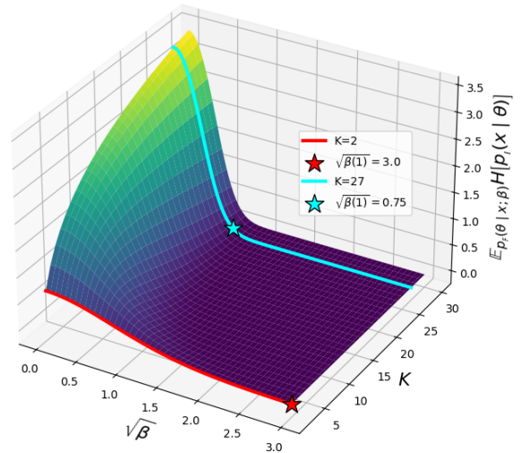

# Bayesian Flow Network - Math Cheat Sheet

## Distribution Glossary

### Input Distribution
This is the prior over data. Each dimension is considered independent. The input distribution the same dimensionality as the data. One point of confusion is they use $\theta$ to describe these prior parameters, these aren't related to the neural network which commonly has $\theta$ assigned for its learnable weights.

$$p_I(\mathbf{x} | \theta) = \prod_{d=1}^{D} p_I(x^{(d)} | \theta^{(d)}).$$

## Discretised Data

### Accuracy scheduler

Accuracy scheduler $\beta(t)$ for discretised and continuous data is derived with the requirement that the expected entropy of the input distribution linearly decreases with t. Intuitively, this means that information flows into the input distribution at a constant rate.
The level of measurement noise informs the choice of $\sigma_1$ which informs accuracy schedule $\beta(t)$, hence the choice of $\sigma_1$ is informed by the width of the discretisation bins, as these place a natural limit on how precisely the data needs to be transmitted. E.g. for 8-bit data with 256 bins and hence a bin width of 1/128, setting  $\sigma_1$ = 1e−3.

 $$ \beta(t) = 1 - \sigma_1^{2t}$$

In the continuous-time loss  

$$
L^{\infty}(x) = -\ln \sigma_{1} \sigma_{1}^{-2t} \left\| x - \hat{k}(\theta, t) \right\|^2
$$

the scaling term $\ln \sigma_1 \sigma_1^{-2t}$ adds bigger penalty towards the end of the run, as accuracy is scheduled to increase with $t$ (i.e. the noise level decreases), hence the bigger penalty for an easier task.

## Discrete Data

### Accuracy scheduler
The guiding heuristic for accuracy scheduler β(t) is to decrease the expected entropy of the input distribution linearly with t.
$$\beta(t) =  t^2 \beta(1), \tag{182}$$
$\alpha(t)$ is related to $\beta(t)$ in the following way:

$$\alpha(t) = \frac{d\beta(t)}{dt} = \beta(1)2t, \tag{183}$$

$\beta(1)$ is determined empirically for each experiment.

**Figure 9: Accuracy schedule vs. expected entropy for discrete data.** The surface plot shows the expectation over the parameter distribution $p(θ | x; β)$ of the entropy of the categorical input distribution $p(x | θ)$ for K = 2 to 30 and $\sqrtβ$ = 0.01 to 3. The red and cyan lines highlight the entropy curves for 2 and 27 classes, the two values that occur in the original paper experiments. The red and cyan stars show the corresponding values we chose for p$\sqrtβ(1)$. (Graves et. al. 2023, p.34)

### Discrete time loss

Discrete-time loss:  

$$
L^n(\mathbf{x}) = n \mathbf{E}_{t\sim U\{1,n\},P(\mathbf{\theta}|\mathbf{x},t_{i-1}), \mathcal{N}\left(\mathbf{y}|\alpha_{i}(K \mathbf{e_x} - 1),\alpha_{i}K\mathbf{I}\right) } \left[ \mathcal{N}\left(\mathbf{y}|\alpha_{i}(K \mathbf{e_x} - 1),\alpha_{i}K\mathbf{I}\right) \right] \tag{189}
$$

$$
= -\sum_{d=1}^{D} \ln \left( \sum_{k=1}^{K} p_{o}^{(d)}(k \mid \theta; t_{i-1}) \mathcal{N}\left(y^{(d)} \mid \alpha_{i}(K\mathbf{e}_k - 1), \alpha_{i} K \mathbf{I} \right) \right),         \tag{190}
$$

where  
$K$ is the number of classes,
$t$ is time
$\mathbf{\theta}$ are parameters of data distribution (i.e. Categorical)
$\mathbf{y}$ is the noisy sample from sender
$\mathbf{e_x}$ is the one-hot vector of data

### Continuous time loss

$$
L^{\infty}(\mathbf{x}) = K\beta(1) \mathbb{E}_{t\sim U(0,1),P_F(\mathbf{\theta}|\mathbf{x},t)} \left[ t\left\| \mathbf{e_x} - \mathbf{\hat{e}}(\mathbf{\theta}, t) \right\|^2 \right] \tag{205}
$$

###  Training algorithm
**Algorithm 8 Continuous-Time Loss $L^\infty(\mathbf{x})$ for Discrete Data**

**Require**: \( \beta(1) \in \mathbb{R}^+ \), number of classes \( K \in \mathbb{N} \)  
**Input**: discrete data \( x \in \{1, K\}^D \)  

$ \tau \sim U(0, 1) $
- \( \beta \leftarrow \beta(1)\tau^2 \)
- \( y \sim \mathcal{N} (\beta (Ke_x - 1) , \beta KI) \)
- \( \theta \leftarrow \text{softmax}(y) \)
- \( p_o( \cdot \mid \theta; t) \leftarrow \text{DISCRETE\_OUTPUT\_DISTRIBUTION}(\theta, t) \)  -- output distribution
- \( \hat{e}(\theta, t) \leftarrow \left( \sum_k p_o^{(1)}(k \mid \theta; t)e_k, ..., \sum_k p_o^{(D)}(k \mid \theta; t)e_k \right) \) -- data expectation
- \(e_x = \text{one\_hot}(x, \text{num\_classes}=K) \)
- \( L^∞(x) \leftarrow K\beta(1)t \left\|e_x - \hat{e}(\theta, t)\right\|^2 \)
----------------------------------------------------------------------
**function** DISCRETE_OUTPUT_DISTRIBUTION(θ ∈ [0, 1]KD, t ∈ [0, 1])  
**Input** (θ, t) to network, receive Ψ(θ, t) as output  
**for** d ∈ {1, D} **do**  
  **if** k = 2 **then**  
   $ p_o^{(d)}(1 | \theta; t) \leftarrow \sigma(\Psi^{(d)}(\theta, t))$   
   $ p_o^{(d)}(2 | \theta; t) \leftarrow 1 - p_o^{(d)}(1 | \theta; t) $  
  **else**  
   \( p_o^{(d)}( \cdot | \theta; t) \leftarrow \text{softmax}(\Psi^{(d)}(\theta, t)) \)  
  **end if**  
**end for**  
**Return** \( p_o( \cdot | \theta; t) \)  
**end function**  
